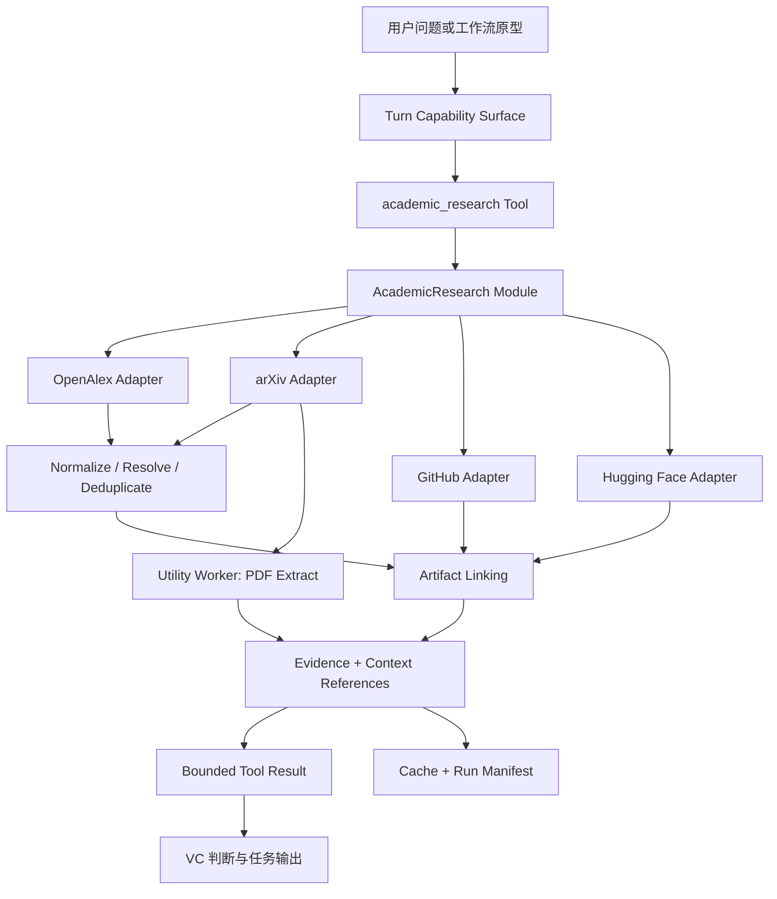

# VC 学术研究 Tool 与五类研究工作流开发方案

> 日期：2026-07-28  
> 状态：Proposed  
> 目标版本：v0.1 原型  
> 范围：OpenAlex、arXiv、GitHub、Hugging Face Hub；论文技术尽调、创始人学术尽调、技术宣称验证、原创性/前序工作图谱、论文到公司映射  
> 不在本轮范围：OpenReview、Crossref、专利检索、工商/融资验证、自动执行外部仓库、MCP Server、量化总评分

## 1. 结论

参考方案的产品方向成立，但不能把其建议的 `Pi Package = Extension + 5 Skills` 原样搬入当前仓库。结合现有 ADR 和运行时边界，本项目应采用：

```text
一个 Host 注册的 academic_research Tool
  └─ 一个深 AcademicResearch Module
      ├─ OpenAlex Adapter
      ├─ arXiv Adapter
      ├─ GitHub Adapter
      ├─ Hugging Face Adapter
      ├─ 实体归一化与关联
      ├─ Evidence / Context Reference
      └─ 缓存与 Run Manifest

五个 Prompt-first 工作流原型
  └─ 通过 Golden Cases 和真实使用验证后
      └─ 晋级为五个 First-party VC Skills
```

关键决策：

1. **底层能力实现为 Host-registered Capability，不实现为 Pi Extension。**
   - 学术检索是本产品的核心 VC 取证能力，不是可有可无的外围集成。
   - Host Capability 可以复用现有 scope、Capability Gateway、轨迹、bounded retrieval、凭据保护和动态工具面。
   - Extension 在 Agent Worker 内作为 Trusted Worker Code 运行，会扩大文件系统和网络信任面；当前 `SnapshotResourceLoader` 还会拒绝所有非空 Extension inventory，直接走 Extension 需要先完成尚未落地的 Integration Build。
   - 直接 Extension Tool 也无法自然进入当前 Host 的 retrieval、Evidence 和授权轨迹。

2. **只向模型暴露一个意图级 Tool：`academic_research`。**
   - 不暴露 `search_openalex`、`search_arxiv` 等数据源级 Tool。
   - Source Adapter 是 Module 的内部 seam，不是模型接口。
   - Tool 隐藏并发、限流、去重、来源降级、缓存和证据关联。

3. **五类产品先做 Prompt-first Validation，再固化为 Skill。**
   - 这遵守 ADR-0026，避免在真实使用前冻结工作流。
   - v0.1 仍然交付五个可运行原型：通过版本化 workflow prompt、输出 contract、Golden Cases 和评测脚本运行。
   - 每个工作流达到晋级门槛后，才复制为 `SKILL.md` 并进入现有 Skills Directory 的导入、检查、激活链路。

4. **学术搜索结果是证据，不是结论。**
   - Tool 只返回结构化实体、关联、来源和明确 warning。
   - “是否原创”“是否 SOTA”“是否由创始人主导”“是否映射到某公司”由工作流在证据范围内判断。
   - 负向搜索不得被表达为不存在证明。

## 2. 与现有架构的关系

本方案遵守以下已接受决策：

| 现有决策 | 本方案的处理 |
|---|---|
| ADR-0019 Evidence Discipline | 可验证事实保留来源；推断与 VC 判断允许存在，但必须与来源事实分开 |
| ADR-0025 User Intent Gate | 搜索和缓存属于任务范围内只读行为；保存正式报告、图谱或修改 Project 文件仍需明确输出意图 |
| ADR-0026 Prompt-first VC Workflows | 五个工作流先以原型 prompt 验证，稳定后晋级 Skill |
| ADR-0028 单一 Skills Directory | 晋级后的 Skill 只进入 app-owned VC Agent Skills Directory |
| ADR-0033 Task-activated Capabilities | `academic_research` 为 on-demand capability，由 broker 或明确 intent hint 激活 |
| ADR-0035 Task-specific Work Outputs | Claim Table、Prior-art Graph、Founder Diligence 等作为任务输出，不建立永久通用 Structured Projection |
| ADR-0048 OS-protected Credentials | OpenAlex、GitHub、HF 凭据只保存 credential reference，密钥使用现有系统保护 |
| ADR-0056 退休大检索载荷 | PDF 正文、README、Model Card 等大内容只在当前 Turn 暴露，之后用 Context Reference 替代 |
| ADR-0057 隔离本地可执行任务 | PDF 下载后的提取和章节解析运行在 Utility Worker，不在 Electron Main 或 Agent Worker 执行第三方解析代码 |
| ADR-0058 单一 Workspace | 首版在现有 workspace 内实现，不创建独立服务、仓库或 MCP Server |

### 2.1 为什么不是 Extension

当前代码中已经存在 `ExtensionInventorySnapshot`、Admission、Global Revision 等 contracts，但 `packages/pi-adapter/src/snapshot-resource-loader.ts` 仍明确：

```text
非 bundled-reviewed 条目会被拒绝
非空 Extension inventory 会被拒绝
```

因此先做 Extension 不只是选择了更大的信任面，还把本功能绑定到了另一个未完成的基础设施项目。学术研究能力进入 `CapabilityRegistry` 后，可以立刻沿用当前普通 Turn 的 broker、visible/executable 分离和 Host 授权。

未来如果需要让 Claude Desktop、Cursor 或其他 Agent 共用能力，再从 AcademicResearch Module 的纯接口增加 MCP Adapter；MCP 不进入 v0.1。

## 3. 产品范围

### 3.1 v0.1 必须完成

- 一个模型可调用 Tool：`academic_research`。
- 四个只读 Source Adapter：
  - OpenAlex
  - arXiv
  - GitHub
  - Hugging Face Hub
- 论文、作者、Artifact、机构、Evidence、Edge 的统一模型。
- 搜索、解析、详情、图谱、全文、资产关联六类 operation。
- 本地缓存、查询 manifest、来源抓取时间和 warning。
- 五类 Prompt-first 工作流原型。
- Golden Cases、fixture tests、真实 API compatibility run。
- 中文问题到英文检索词的工作流级查询规划。
- 明确的不确定性和来源边界。

### 3.2 v0.1 明确不做

- 不验证正式会议接收和评审意见。
- 不将 arXiv 记录表述为同行评审结果。
- 不验证公司工商、任职、融资或知识产权归属。
- 不使用 GitHub Code Search。
- 不 clone、install、import 或执行外部代码和模型。
- 不抓取私有仓库、私有 HF Repo 或 gated 内容。
- 不为论文、作者或公司输出一个综合数字分。
- 不把 GitHub Star、HF downloads 或引用数当作商业采用。
- 不把“未搜索到”当成“不存在”。

## 4. 总体运行链路



### 4.1 外部 seam

模型、Capability tests 和未来 MCP Adapter 都只依赖一个 Interface：

```ts
interface AcademicResearch {
  execute(
    request: AcademicResearchRequest,
    context: AcademicResearchContext
  ): Promise<AcademicResearchResult>;
}
```

这个 Module 的 Interface 包含：

- operation 和参数 schema；
- 返回结果上限；
- 证据完整性规则；
- 错误与部分成功语义；
- 缓存 freshness；
- 允许访问的数据源；
- 不执行外部资产的安全不变量。

Source Adapter、缓存、下载器、PDF 提取器和关联器全部是内部 seam。调用方不需要理解任何上游 API。

### 4.2 内部 seam

只有确实存在四个实现变化时才建立 Source Adapter Interface：

```ts
interface AcademicSourceAdapter {
  readonly source: AcademicSource;
  supports(operation: AcademicOperation, target: AcademicTarget): boolean;
  execute(request: SourceRequest, context: SourceContext): Promise<SourceResult>;
}
```

Adapter 必须返回统一 `SourceRecord`，不得把原始 OpenAlex、Atom、GitHub 或 HF 响应泄漏到模型接口。

## 5. Tool Interface

### 5.1 名称与 capability tier

```text
Capability ID: academic_research
Tier: on_demand
Scope: project + unscoped
Action class: read
Activation: capability_request 或 intent preload hint
```

建议 `useWhen`：

```text
Use for AI papers, authors, citations, prior work, open-source repositories,
models, datasets, demos, technical claims, and research-to-company signals.
Do not use it to prove conference acceptance, employment, financing, patents,
or commercial adoption.
```

### 5.2 Request

```ts
type AcademicResearchRequest = {
  operation:
    | "search"
    | "resolve"
    | "inspect"
    | "graph"
    | "fetch_content"
    | "link_artifacts";

  queries?: string[];
  identifier?: {
    kind: "title" | "doi" | "arxiv" | "openalex" | "url" | "github" | "huggingface";
    value: string;
  };

  targets?: Array<
    "works" | "authors" | "repositories" | "models" | "datasets" | "spaces"
  >;
  sources?: Array<"openalex" | "arxiv" | "github" | "huggingface">;

  filters?: {
    dateFrom?: string;
    dateTo?: string;
    authors?: string[];
    institutions?: string[];
    categories?: string[];
    minStars?: number;
    updatedAfter?: string;
  };

  relation?: "references" | "citations" | "related" | "coauthors" | "artifacts";
  contentLevel?: "metadata" | "abstract" | "sections";
  sort?: "relevance" | "recent" | "citations" | "activity" | "popularity";

  limit?: number;
  maxChars?: number;
};
```

约束：

- `queries` 最多 6 个，每个最多 500 字符。
- `limit` 默认 10，最大 25；OpenAlex semantic search 的上游上限不应成为外部 Interface 的承诺。
- `maxChars` 使用现有 bounded retrieval policy，不能由模型无限放大。
- `fetch_content` v0.1 不向模型返回整篇全文，只返回选定章节或 bounded excerpt。
- `sources` 是诊断/复核提示，不要求工作流知道每个源的具体 endpoint。

### 5.3 Result

```ts
interface AcademicResearchResult {
  schemaVersion: 1;
  runId: string;
  operation: AcademicOperation;
  status: "completed" | "partial" | "unavailable";
  entities: AcademicEntitySummary[];
  edges: AcademicEdge[];
  evidence: EvidenceReference[];
  omittedItems: number;
  warnings: AcademicWarning[];
  sourceStatus: SourceStatus[];
  contextReference: ContextReference;
}
```

部分源失败时返回 `partial`，不把整个请求伪装为失败，也不静默忽略失败源。`sourceStatus` 至少包含：

```text
source
attempted
status
retrievedAt
cacheStatus
httpStatusClass（可选）
rateLimitReset（可选）
warningCode（可选）
```

## 6. 统一数据模型

### 6.1 Work

```ts
interface WorkEntity {
  entityId: string;
  type: "work";
  title: string;
  abstract?: string;
  authors: AuthorReference[];
  institutions: InstitutionReference[];
  publicationDate?: string;
  firstSubmittedDate?: string;
  lastUpdatedDate?: string;
  identifiers: {
    doi?: string;
    arxiv?: string;
    openalex?: string;
  };
  categories: string[];
  topics: string[];
  citationCount?: number;
  referenceCount?: number;
  primaryUrl?: string;
  pdfUrl?: string;
  publicationStatus: "preprint" | "indexed_publication" | "unknown";
  sourceRecords: SourceRecord[];
}
```

`indexed_publication` 只表示结构化索引中存在出版记录，不等于本 Tool 已独立核验 venue decision。

### 6.2 Author

```ts
interface AuthorEntity {
  entityId: string;
  type: "author";
  displayName: string;
  alternativeNames: string[];
  affiliations: InstitutionReference[];
  identifiers: { openalex?: string; github?: string; huggingface?: string };
  works: WorkReference[];
  sourceRecords: SourceRecord[];
  resolutionStatus: "resolved" | "candidate" | "ambiguous";
}
```

作者消歧必须保留候选集和使用的证据字段；不能只按姓名合并。

### 6.3 Artifact

```ts
interface ArtifactEntity {
  entityId: string;
  type: "github_repository" | "hf_model" | "hf_dataset" | "hf_space";
  owner: string;
  name: string;
  url: string;
  description?: string;
  createdAt?: string;
  updatedAt?: string;
  license?: string;
  tags: string[];
  metrics: {
    stars?: number;
    forks?: number;
    downloads?: number;
    likes?: number;
    contributors?: number;
    commitsLast90Days?: number;
  };
  files: ArtifactFileSummary[];
  linkedWorks: EntityLink[];
  sourceRecords: SourceRecord[];
}
```

### 6.4 Evidence 和 Edge

```ts
interface EvidenceRecord {
  evidenceId: string;
  source: AcademicSource;
  sourceEntityId: string;
  sourceUrl: string;
  retrievedAt: string;
  evidenceType:
    | "metadata"
    | "abstract"
    | "paper_text"
    | "citation_graph"
    | "repository"
    | "readme"
    | "commit_history"
    | "model_card"
    | "dataset_card"
    | "space_card";
  supportedFields: string[];
  excerpt?: string;
  contentHash?: string;
  localSnapshotRef?: string;
}

interface AcademicEdge {
  sourceEntityId: string;
  targetEntityId: string;
  relation:
    | "references"
    | "cites"
    | "related"
    | "coauthor"
    | "artifact_of"
    | "possible_organization_link"
    | "direct_predecessor"
    | "follow_up"
    | "alternative_route";
  confidence: "high" | "medium" | "low";
  evidenceIds: string[];
}
```

## 7. 四个 Source Adapter

### 7.1 OpenAlex Adapter

v0.1 operations：

```text
searchWorks
getWork
searchAuthors
getAuthor
getReferences
getCitations
getRelatedWorks
```

实现规则：

- `/works` 是论文发现和去重主索引。
- `/authors` 用于候选作者和机构/主题辅助消歧。
- 优先使用 DOI、arXiv ID、OpenAlex ID 做确定性解析。
- 普通 query 使用 full-text search；长技术描述可使用 semantic search。
- 使用 `select` 限制字段，避免把大响应写入上下文和缓存。
- 保存上游 relevance，不直接将其表达为质量分。
- API key 为当前正式依赖；免费 key 有每日用量额度，必须显示 quota exhaustion，而不是无限重试。

### 7.2 arXiv Adapter

v0.1 operations：

```text
searchPapers
getPaperById
getVersions
downloadPdf
```

实现规则：

- Atom 响应在 Adapter 内解析并映射为 `WorkEntity`。
- arXiv ID 统一去掉 URL、版本后缀后再解析，但版本信息另行保留。
- `publicationStatus` 固定为 `preprint`，除非其他来源提供索引记录；即使存在 journal reference，也不由 arXiv 单源确认接收状态。
- 请求通过单一队列、可取消 timeout、`Retry-After` 和指数退避控制。
- 当前官方 Terms 要求 legacy API 对同一控制主体整体最多每 3 秒一个请求且只使用一个连接；v0.1 以此作为硬下限，并允许通过配置变得更保守，不能通过并发或多进程绕过。
- release compatibility run 必须重新读取最新 Terms；规则变化通过 Adapter policy revision 更新，不能散落在 workflow 中。
- PDF 先下载到 app-data staging，校验 content type、大小、hash，再交 Utility Worker。
- PDF 和提取正文默认只为当前任务短期保留，任务完成或 bounded TTL 到期后删除；不得从产品中重新分发或对外提供 arXiv e-print。只有论文许可明确允许且用户明确要求保存时，才评估保留原文副本。

### 7.3 GitHub Adapter

v0.1 operations：

```text
searchRepositories
getRepository
getReadme
getContributors
getRecentCommits
getReleases
getLanguages
```

实现规则：

- 不做全局 Code Search。
- 查询组合由工作流生成，Adapter 只执行确定性请求。
- REST 请求发送显式 `X-GitHub-Api-Version`。
- 独立处理 `core`、`search` 和 secondary rate limits。
- GitHub Token 可选；未配置时能力降级并显示低配额 warning。
- 不访问 private repo。
- README 只作作者/维护者自述证据，不作独立验证。
- `commitsLast90Days` 说明采样窗口和截断状态，不伪装成完整工程统计。

### 7.4 Hugging Face Adapter

v0.1 operations：

```text
searchModels
searchDatasets
searchSpaces
getModel
getDataset
getSpace
getCard
getRepoFiles
```

实现规则：

- TypeScript 首版直接调用官方 Hub HTTP endpoints，并按官方 OpenAPI fixture 校验；不为只读查询引入 Python client。
- 列表结果和详情结果分开处理，列表缺失字段不能被表达为“无”。
- HF Token 可选；v0.1 只读公共、非 gated 内容。
- Model/Dataset/Space Card 属于发布者自述。
- downloads、likes 是平台热度信号，不是客户或性能证据。

## 8. 实体解析、去重与关联

### 8.1 Work 去重顺序

1. DOI 完全一致。
2. arXiv ID（忽略版本后缀）一致。
3. OpenAlex ID 一致。
4. 标准化标题完全一致，且第一作者候选一致。
5. 标题高相似、作者有重合、年份相差不超过一年：只生成 `possible_same_work` 候选，不自动合并。

自动合并必须保存 merge trace：

```text
input entity IDs
rule
matched fields
conflicts
output entity ID
timestamp
```

### 8.2 作者消歧

至少组合两类信号：

- 姓名或 alternative name；
- 合作者；
- 机构；
- 研究主题；
- 论文标题；
- GitHub/HF 组织链接；
- 个人主页 URL（若上游记录提供）。

冲突或证据不足时返回多个 candidate，不自动选中。

### 8.3 论文与 Artifact 关联

高置信度：

- README/Card 明确包含 DOI 或 arXiv ID；
- 论文正文明确链接该资产；
- GitHub 与 HF 相互链接；
- 完全相同的项目 URL。

中置信度：

- 论文标题完全一致；
- Owner 与已解析作者/实验室名称一致；
- README/Card 同时包含方法名称和主要作者。

低置信度：

- 只有名称或关键词相似；
- 第三方复现；
- 单一用户的 Star、Fork 或关注行为。

只有高置信度关联可以标记为 `official_or_author_linked`；中低置信度必须显示限定语。

## 9. Evidence、缓存与持久化

### 9.1 目录

```text
<app-data>/academic-research/
├── cache/
│   ├── metadata.sqlite
│   └── bodies/
└── runs/
    └── <run-id>/
        ├── request.json
        ├── source-status.json
        ├── entities.jsonl
        ├── edges.jsonl
        ├── evidence.jsonl
        ├── merge-trace.jsonl
        ├── warnings.json
        └── staged-content/
```

Project 目录只在用户明确要求保存报告/图谱时产生 Work Output。普通搜索缓存和诊断 manifest 不成为 Project 文件，也不成为 Memory。

### 9.2 缓存建议

| 内容 | 默认 TTL |
|---|---:|
| OpenAlex 搜索 | 24 小时 |
| OpenAlex work/author | 7 天 |
| arXiv 搜索 | 6 小时 |
| arXiv metadata | 24 小时 |
| arXiv PDF 与提取正文 | 默认仅当前任务/短 TTL，随后删除 |
| GitHub repository metadata | 2 小时 |
| GitHub README | 6 小时 |
| GitHub commits/contributors | 1 小时 |
| HF 搜索 | 2 小时 |
| HF details/Card | 6 小时 |

TTL 是产品默认值，不是事实新鲜度保证。Result 必须包含 `retrievedAt` 和 `cacheStatus`。

### 9.3 上下文控制

- Tool 返回最多 10 个核心结果，用户显式要求时最多 25 个。
- Tool 文本结果默认不超过 15 KB；其余通过 Context Reference 再取。
- PDF、README、Card、commit list 等大 payload 在 Turn 后退休。
- 原始响应不进入 Thread 正文；只在 app-data cache 中按大小、TTL 和 hash 管理。
- arXiv descriptive metadata 可以缓存；e-print 内容不进入长期共享 cache，也不作为产品对外提供的内容。
- 轨迹记录 query hash、source、entity/evidence IDs、warning 和 retrieval 状态，不记录密钥或完整原始响应。

## 10. 凭据与安全

新增 Academic Source Settings，只保存：

```text
source
enabled
credentialRef（可选）
status
lastValidatedAt
quota/rate-limit summary（无 secret）
```

凭据：

- OpenAlex API key：v0.1 正式依赖。
- GitHub Token：可选，只读 public metadata。
- HF Token：可选，只读 public metadata。
- arXiv：无凭据。

安全不变量：

- 仅访问四个官方 host allowlist。
- 每次 redirect 重新验证 host、scheme 和公共 IP，防止 SSRF。
- 禁止 URL userinfo 和非标准端口。
- 限制 response bytes、redirect 次数、timeout 和 decompressed size。
- 日志、warning、trajectory 不包含 authorization header、query key 或 token。
- 不执行、import、clone、install 或 deserialize 外部仓库代码。
- PDF 提取运行在 Utility Worker，输出 staged result，Host 校验后再使用。

## 11. 五个 Prompt-first 工作流原型

五个原型共享：

```text
references/evidence-policy.md
references/author-resolution-policy.md
references/artifact-link-policy.md
references/claim-status-policy.md
```

原型阶段这些规则作为测试 fixture 和版本化 workflow prompt 存放，不注册为 First-party Skill。

### 11.1 论文技术尽调

Workflow ID：

```text
paper-technical-diligence
```

输入：

- arXiv/DOI/OpenAlex URL 或 ID；
- 论文标题；
- 可选创业方向/投资问题。

执行：

1. resolve 种子论文。
2. inspect 元数据与摘要。
3. fetch_content 获取 Introduction、Method、Experiments、Limitations 的 bounded sections。
4. graph 获取前序、引用和 related work。
5. link_artifacts 检查 GitHub/HF 资产。
6. 区分来源事实、作者主张、模型推断和 VC 判断。

输出：

```text
核心结论
问题与方法
创新增量
实验是否支撑
代码/模型/数据开放度
局限与 Scaling 证据
产业化价值
对创业项目的意义
未验证事项
Evidence references
```

禁止输出简单总分。

### 11.2 创始人学术能力尽调

Workflow ID：

```text
founder-academic-diligence
```

执行：

1. search author candidates。
2. 使用机构、合作者、主题和资产做身份消歧。
3. 选择代表作而不是机械统计论文数。
4. 分析作者顺序、主题连续性、合作网络和资产贡献信号。
5. 与用户给定创业方向比较。

输出：

```text
身份确认情况
代表性成果
论文贡献角色
研究方向连续性
独立研究能力
工程实现信号
合作网络
与创业方向匹配度
优势
风险与证据缺口
```

不能从公开论文推断人格、领导力、管理或商业能力。

### 11.3 技术宣称验证

Workflow ID：

```text
technical-claim-verification
```

执行：

1. 将原始宣传拆成原子 Claim。
2. 为每个 Claim 生成可审计 query plan。
3. 搜索支持证据和限制/反证。
4. 检查证据实际支持的范围。
5. 按离散状态给出结论。

允许状态：

```text
已验证
基本支持
部分支持
证据冲突
无法验证
已被反证
```

输出必须是 Claim Matrix，并保留“当前四源覆盖范围”的限定。

### 11.4 原创性与前序工作图谱

Workflow ID：

```text
novelty-and-prior-art-map
```

这里的 prior art 只表示学术前序工作，不表示法律专利检索。

执行：

1. 定义种子技术和核心模块。
2. 为模块生成多组术语、缩写和替代表达。
3. 拉取 references、citations、related 和同期 arXiv。
4. 检查 GitHub/HF 工程化和第三方复现。
5. 生成路线分类和有 Evidence 的 Edge。

输出：

```text
基础工作
直接前序工作
种子工作的增量
同期独立工作
后续改进
替代路线
工程实现/复现
原创性判断
可复制性与替代风险
```

若用户明确要求保存，额外输出 `graph.json`，它是 Task-specific Work Output。

### 11.5 论文到公司映射

Workflow ID：

```text
research-to-company-map
```

执行：

```text
论文
→ 作者候选
→ 机构/实验室
→ GitHub/HF user 或 organization
→ 对应 repo/model/dataset/space
→ 组织主页或商业域名信号
→ 候选产业化主体
```

输出用词限定为：

```text
候选商业化组织
疑似产业化主体
可能存在关联
```

只有四源时不能输出“已确认公司映射”。强、中、弱信号分别展示，低置信度不进入主结论。

## 12. Skill 晋级机制

每个工作流满足以下条件后，才从 prompt prototype 晋级 First-party VC Skill：

1. 至少 10 个 Golden Cases；其中至少 3 个包含不利证据或无法验证结果。
2. 连续 20 次真实使用没有出现严重工作流结构调整。
3. 事实引用完整率达到 100%。
4. arXiv 被误表述为正式接收的次数为 0。
5. 同名作者错误合并率低于 2%。
6. 非官方 Artifact 被标记为官方的次数为 0。
7. 用户对输出结构的保留率达到 80% 以上。
8. workflow prompt 的核心步骤至少两个版本保持稳定。

晋级后目录：

```text
skills/
├── paper-technical-diligence/
│   ├── SKILL.md
│   └── references/        # 包内政策副本
├── founder-academic-diligence/
│   └── references/        # 包内政策副本
├── technical-claim-verification/
│   └── references/        # 包内政策副本
├── novelty-and-prior-art-map/
│   └── references/        # 包内政策副本
└── research-to-company-map/
    └── references/        # 包内政策副本
```

原型阶段可以维护一份 canonical policy source；晋级脚本将所需政策复制到每个完整 Skill 包内。运行时 Skill 不跨包引用 `../_shared`，因为现有 `SkillPackageManager` 要求引用留在被复制的完整包内，并会阻止 path escape。

实际部署时，这些目录分别通过现有 `SkillPackageManager` 导入、inspect、activate，不新增第二个 Skill loader。

## 13. 代码布局

首版不新增 workspace package。先在 owning modules 内形成深 Module；只有未来 MCP/CLI 出现第二个真实调用方时，再评估抽出 pure core package。

预计新增：

```text
packages/contracts/src/academic-research.ts

packages/capabilities/src/academic-research.ts

packages/host-services/src/academic-research/
├── academic-research.ts
├── models.ts
├── query-planner.ts
├── normalizer.ts
├── resolver.ts
├── artifact-linker.ts
├── evidence-builder.ts
├── cache.ts
├── run-store.ts
├── http-access.ts
└── adapters/
    ├── openalex.ts
    ├── arxiv.ts
    ├── github.ts
    └── huggingface.ts

apps/utility-worker/src/academic-pdf-extract.ts

tests/academic-research/
├── adapters/
├── fixtures/
├── normalization/
├── linking/
├── capability/
├── workflows/
└── golden-cases/

docs/workflows/academic-research/
├── paper-technical-diligence.md
├── founder-academic-diligence.md
├── technical-claim-verification.md
├── novelty-and-prior-art-map.md
├── research-to-company-map.md
└── references/
```

预计修改：

```text
packages/contracts/src/index.ts
packages/contracts/src/capability.ts
packages/contracts/src/trajectory.ts
packages/contracts/src/ipc.ts
packages/capabilities/src/index.ts
packages/capabilities/src/turn-capability-surface.ts
packages/host-services/src/index.ts
packages/host-services/src/app-data-paths.ts
apps/utility-worker/src/index.ts
apps/desktop/src/main/main.ts
apps/desktop/src/main/protected-credential-service.ts
apps/desktop/src/renderer/App.tsx
apps/desktop/src/renderer/i18n.ts
package.json
CONTEXT.md
```

## 14. 开发切片

### P0：ADR、Interface 和失败基线

目标：冻结本功能的产品边界和安全语义。

任务：

1. 新增 ADR：学术研究是 Host Capability，而非 Pi Extension。
2. 在 `CONTEXT.md` 增加 Academic Research、Academic Evidence、Artifact Link、Workflow Prototype。
3. 冻结 request/result/entity/evidence contracts。
4. 保存 5 类最小 Golden Cases。
5. 增加当前失败测试：`academic_research` 尚不可发现。

完成标准：

- Interface 不暴露 source-specific raw response。
- 明确五个工作流的 Prompt-first → Skill 晋级路径。
- Extension 与 Capability 的选择不再悬而未决。

预计：0.5-1 天。

### P1：AcademicResearch Module 骨架与 fixture adapters

目标：建立可测试的外部 seam，不先接真实网络。

任务：

1. 实现 Module、Source Adapter Interface 和 dependency injection。
2. 实现四个 fixture adapter。
3. 实现 bounded result、partial success、source status 和 warning。
4. 实现 deterministic run ID/input hash。

测试：

- source selection；
- timeout/cancel；
- 一源失败、三源成功；
- output limits；
- raw response 不泄漏。

预计：1-1.5 天。

### P2：OpenAlex + arXiv 论文纵向切片

目标：完成搜索、解析、论文合并和正文入口。

任务：

1. OpenAlex works/authors/search/graph。
2. arXiv Atom search/id/version。
3. DOI/arXiv/OpenAlex ID normalization。
4. Work 去重和 merge trace。
5. OpenAlex credential setting。
6. arXiv PDF download staging。

完成标准：

- 已知 arXiv/OpenAlex 同一论文正确合并。
- 预印本状态不被升级。
- 配额、429、5xx、timeout 明确返回。

预计：2-3 天。

### P3：Utility Worker PDF 提取

目标：支持 bounded section retrieval，遵守本地执行隔离。

任务：

1. 新增 versioned PDF extract job manifest。
2. 校验文件路径、hash、大小和 MIME。
3. 输出页级文本、章节候选和 line/page references。
4. Host 校验 staged result 后生成 Evidence。
5. 大正文只通过 Context Reference 暴露。

完成标准：

- Host/Agent Worker 不执行 PDF parser。
- 中断、损坏 PDF、超大 PDF 都安全失败。
- excerpt 可回到页码或稳定 section reference。

预计：1-1.5 天。

### P4：GitHub + Hugging Face Artifact 纵向切片

目标：打通论文—代码—模型—数据—Demo。

任务：

1. GitHub repository search/details/README/activity。
2. HF model/dataset/space search/details/card/files。
3. credential settings 和 rate-limit status。
4. Artifact normalization。
5. 高/中/低置信度 link rules。

完成标准：

- 不使用 Code Search。
- 第三方复现不会被标记为官方。
- Star/downloads 不进入商业采用字段。

预计：2-3 天。

### P5：Capability、动态工具面和 UI 配置

目标：让普通 Project/Unscoped Turn 可以按需发现和调用 Tool。

任务：

1. 注册 `academic_research` Capability。
2. 在 `TurnCapabilitySurface` 中设为 `on_demand`。
3. 增加学术研究 intent preload hint，但 hint 不作为可用性的硬门槛。
4. broker catalog 可发现该能力。
5. Gateway 继续执行 scope/state/limits 校验。
6. Settings 显示四源 enabled、credential、quota 和 health。
7. UI tool activity 展示 source、status、entity/evidence count 和 warning。

完成标准：

- 普通对话不默认注入大 schema。
- 学术问题能通过 preload 或 broker 在同一 Turn 激活。
- Project/Unscoped 都可只读搜索。
- tool activity 不显示 secret 和整段 raw payload。

预计：1.5-2 天。

### P6：五个 Prompt-first 工作流原型

目标：交付五类可直接使用的产品原型。

顺序：

```text
1. technical-claim-verification
2. paper-technical-diligence
3. novelty-and-prior-art-map
4. founder-academic-diligence
5. research-to-company-map
```

任务：

1. 版本化 workflow prompt 和 output contract。
2. 共用 Evidence、作者消歧和 Artifact link policy。
3. 为每类建立至少 5 个初始 Golden Cases。
4. 保存 query plan、调用轨迹和结果审阅表。
5. 收集用户修改和误判类型。

完成标准：

- 五类工作流都能从普通 Thread 运行。
- 每个事实引用 Evidence ID。
- 每个原型可以输出“无法验证”。

预计：2-3 天。

### P7：缓存、审计、上下文退休与输出

目标：让原型可持续使用而不污染长期上下文。

任务：

1. SQLite metadata cache 和 body cache。
2. Run Manifest、merge trace、source status。
3. Context Reference retirement/re-retrieval。
4. 用户明确要求时保存 Claim Matrix、Diligence Report 或 graph.json。
5. 缓存清理和 app-data recovery。

完成标准：

- 重复检索命中缓存且保留 freshness。
- 大 payload 不跨 Turn 常驻。
- 缓存不是 Project Memory 或 Long-term Memory。
- Work Output 仍受 User Intent Gate。

预计：1.5-2 天。

### P8：真实兼容性、评测与 Skill 晋级决策

目标：证明四个真实源和真实 Provider 的多步调用可用。

任务：

1. 新增：

```bash
pnpm academic-research:compat
```

2. 真实验证：
   - OpenAlex search/resolve/graph；
   - arXiv search/version/PDF section；
   - GitHub search/details/README/activity；
   - HF model/dataset/space/Card；
   - 一源 rate-limit 时 partial result；
   - broker → activate → tool call；
   - 五类 workflow 的真实 Provider 调用。
3. 证据写入仓库外，只保留脱敏状态、source、IDs、usage、latency 和终态。
4. 依据第 12 节门槛决定哪些 workflow 晋级 Skill。

预计：1-2 天编码，另加真实运行和人工审阅时间。

### 总工期

| Slice | 预计 |
|---|---:|
| P0 | 0.5-1 天 |
| P1 | 1-1.5 天 |
| P2 | 2-3 天 |
| P3 | 1-1.5 天 |
| P4 | 2-3 天 |
| P5 | 1.5-2 天 |
| P6 | 2-3 天 |
| P7 | 1.5-2 天 |
| P8 | 1-2 天 |
| 合计 | 12.5-19 天 |

不含等待 API credential、上游故障、真实 Provider 配额和用户评审时间。

## 15. 测试矩阵

### 15.1 Tool/Module

| ID | 场景 | 层级 |
|---|---|---|
| AR-T-001 | operation/target/source 组合校验 | Contract |
| AR-T-002 | 任一 source 失败返回 partial | Unit |
| AR-T-003 | 输出严格受 item/char 限制 | Unit |
| AR-T-004 | DOI/arXiv/OpenAlex ID 归一化 | Unit |
| AR-T-005 | 同一论文跨源合并 | Unit/Fixture |
| AR-T-006 | 标题相似但作者冲突不自动合并 | Unit |
| AR-T-007 | 作者同名返回 ambiguous candidates | Unit |
| AR-T-008 | 官方资产高置信关联 | Unit |
| AR-T-009 | 第三方复现不标为官方 | Unit |
| AR-T-010 | 429/Retry-After/quota exhaustion | Adapter |
| AR-T-011 | redirect/SSRF/size/timeout 防护 | Security |
| AR-T-012 | secret/raw header 不进入日志和 trajectory | Security |
| AR-T-013 | PDF 只在 Utility Worker 解析 | Architecture |
| AR-T-014 | 大正文跨 Turn 被 Context Reference 替代 | Integration |
| AR-T-015 | broker 可发现并激活 academic_research | Integration |
| AR-T-016 | 普通问候不误激活学术 Tool | Provider Fixture |
| AR-T-017 | Project 与 Unscoped 只读均可用 | Integration |
| AR-T-018 | 明确输出意图才保存报告或 graph | Integration |

### 15.2 工作流

| ID | 场景 | 预期 |
|---|---|---|
| AR-W-001 | arXiv 论文尽调 | 明确标记预印本 |
| AR-W-002 | 自报 SOTA 且无独立证据 | 部分支持/无法验证 |
| AR-W-003 | 同名创始人 | 停留在候选身份 |
| AR-W-004 | 高引用但无代码 | 不推断工程成熟 |
| AR-W-005 | 有 repo 但缺核心训练代码 | 部分开源 |
| AR-W-006 | “全球首个” | 不以负向搜索证明 |
| AR-W-007 | 同期独立工作 | 进入 prior-art map |
| AR-W-008 | 第三方复现 | 与官方资产分开 |
| AR-W-009 | GitHub/HF 组织互链 | 高置信候选主体 |
| AR-W-010 | 只有名称相似的公司 | 低置信且不进主结论 |

## 16. Golden Cases

初始案例应覆盖用户实际关注的 AI 投资方向，但测试数据应固定为 ID、日期和期望关系，不能只写自然语言名称：

- Memory³、δ-mem、MemOS：版本合并、前序和同期路线。
- RoboMemory / RoboTwin / RoboDojo：作者、组织和具身资产。
- VLA / WAM / 分层灵巧操作：路线聚类和替代技术。
- Kernel Agent / kernel code generation：论文到代码资产。
- 潜空间推理 / 循环 Transformer：相近标题和路线误合并。
- “百万级 LoRA 调度”：宣传口径拆解。
- “2M context”“全球首个记忆原生基座模型”：负向搜索和范围限定。

每个 Golden Case 包含：

```text
seed input
fixed source fixtures
expected entities
must-link / must-not-link
expected claim states
forbidden statements
expected warnings
```

## 17. 指标与验收目标

这些是原型验收目标，不是对上游数据质量的承诺：

| 指标 | 目标 |
|---|---:|
| 已知论文 ID 解析准确率 | ≥ 98% |
| arXiv/OpenAlex 同一论文合并准确率 | ≥ 95% |
| 错误自动合并率 | ≤ 2% |
| 高置信官方 Artifact 关联准确率 | ≥ 95% |
| Evidence 必填字段完整率 | 100% |
| 确定性事实 Evidence 覆盖率 | 100% |
| arXiv 被误称正式接收 | 0 |
| 第三方资产误称官方 | 0 |
| secret/raw auth 泄漏 | 0 |
| Tool 超出输出上限 | 0 |
| 上游失败被明确披露 | 100% |

不为 `research-to-company-map` 设置“公司映射召回率”，因为四源本身不构成完整公司数据库。v0.1 只评估关联证据准确性和措辞校准。

## 18. 风险与控制

### 18.1 四源无法验证顶会接收

控制：

- publication status 只允许 `preprint`、`indexed_publication`、`unknown`。
- 所有 workflow 保留“正式接收未核验”字段。
- 第二阶段优先接 OpenReview 和 Crossref，而不是用推断补空白。

### 18.2 作者消歧错误

控制：

- 默认保留 candidate，不追求强制单一答案。
- 自动合并要求至少两类一致信号。
- founder workflow 对 ambiguous identity 自动降级。

### 18.3 API 配额和规则变化

控制：

- Adapter 读取 response headers，不在模型提示中硬编码永久限流数字。
- arXiv 当前 3 秒/单连接规则作为 versioned Adapter policy 实现，不能由 workflow 或并发执行覆盖。
- 健康状态显示 credential/quota/rate-limit。
- 真实 compatibility run 定期核验官方文档和 Terms。
- 不自动切换到网页爬取作为静默 fallback。

### 18.4 arXiv 内容许可与重新分发

控制：

- 元数据与 e-print 内容使用不同的 retention policy。
- PDF/全文仅为单用户当前任务短期处理，不由产品对外服务或重新分发。
- 默认保留结构化 metadata、hash、来源 URL 和 bounded evidence excerpt，而不是完整 PDF。
- 若未来改为团队服务、云端缓存或共享研究库，必须先完成单独的许可评审，不能沿用本地单用户原型的假设。

### 18.5 Tool Interface 变得过宽

控制：

- 只保留六个稳定 operation。
- source-specific filters 不进入外部 Interface。
- 新数据源优先适配现有 operation，不新增模型 Tool。
- 使用 deletion test：删除 Module 后，去重、缓存、证据、限流和关联复杂度会散落到所有 workflow，说明 Module 正在提供 Depth。

### 18.6 大 PDF 和长 Card 污染上下文

控制：

- bounded sections；
- staged extraction；
- Context Reference；
- Turn 后退休；
- 原始内容不写入普通 Thread message。

### 18.7 过早固化 Skill

控制：

- 原型和 Skill 明确分阶段。
- 晋级门槛要求真实使用稳定性和 Golden Cases。
- 未晋级 workflow 仍可作为普通 prompt 使用，不阻塞产品验证。

## 19. 每阶段验证命令

确定性开发：

```bash
pnpm typecheck
pnpm vitest run tests/academic-research
pnpm vitest run tests/capabilities/turn-capability-surface.test.ts
pnpm vitest run tests/pi-adapter/tracer.test.ts
```

完整回归：

```bash
pnpm verify
pnpm integration-gate:release
pnpm personal-build-gate
```

真实数据源与 Provider：

```bash
pnpm academic-research:compat
pnpm personal-build-gate:release
```

## 20. Definition of Done

以下条件同时满足，v0.1 才完成：

1. `academic_research` 作为一个 on-demand Host Capability 可被 broker 发现、激活和调用。
2. 四个 Adapter 通过 fixture、真实 API 和错误降级测试。
3. 同一论文的 OpenAlex/arXiv 记录可以合并并保留版本。
4. GitHub/HF 资产关联有 Evidence 和置信度，不把第三方资产误称官方。
5. PDF 解析在 Utility Worker 完成，正文用 bounded excerpt 和 Context Reference 暴露。
6. API key/token 只通过 OS-protected credential reference 使用。
7. Tool 的每项事实都可追溯到 Evidence；一源失败会明确返回 partial/warning。
8. 五个 Prompt-first 工作流原型均可在普通 Thread 中运行。
9. 五个原型均可正确输出“无法验证”，不会把负向搜索当不存在证明。
10. 报告、Claim Matrix 和 graph 只有在明确输出意图下保存。
11. 大 retrieval payload 不跨 Turn 常驻。
12. Unit、Architecture、Integration、E2E、release gates 和真实 compatibility run 通过。
13. 至少一个 workflow 达到晋级门槛并完整走通 Skills Directory 的 import/inspect/activate；其余未达门槛者继续保留为原型，不为追求数量强行晋级。
14. ADR、CONTEXT、Tool descriptions、UI 状态和实际实现一致。

## 21. 后续优先级

v0.2 建议按以下顺序扩展：

```text
OpenReview
→ Crossref
→ DBLP / ACL Anthology / CVF / PMLR
→ ORCID / ROR
→ Zenodo / DataCite
→ PubMed / Europe PMC
```

其中 OpenReview 和 Crossref 优先，因为它们直接补上 v0.1 最大的证据缺口：正式接收、评审/decision 和出版版本解析。

当出现第二个真实调用方（例如内部 CLI、团队研究后台或其他 Agent）时，再从 AcademicResearch Module 增加 MCP Adapter。MCP 只做互操作，不承载 VC 判断方法。

## 22. 官方接口参考

- [OpenAlex API Overview](https://developers.openalex.org/api-reference/introduction)
- [OpenAlex Search](https://developers.openalex.org/guides/searching)
- [OpenAlex Authentication & Pricing](https://developers.openalex.org/guides/authentication)
- [GitHub REST API rate limits](https://docs.github.com/en/rest/using-the-rest-api/rate-limits-for-the-rest-api)
- [GitHub rate-limit endpoint](https://docs.github.com/en/rest/rate-limit/rate-limit)
- [Hugging Face Hub API endpoints](https://huggingface.co/docs/hub/en/api)
- [Hugging Face Hub search](https://huggingface.co/docs/huggingface_hub/en/guides/search)
- [arXiv API Terms of Use](https://info.arxiv.org/help/api/tou.html)
